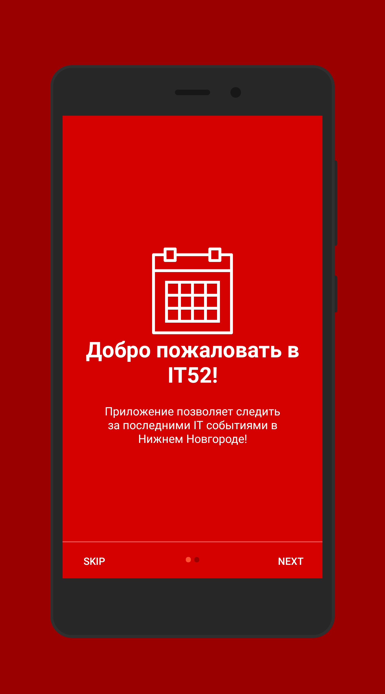
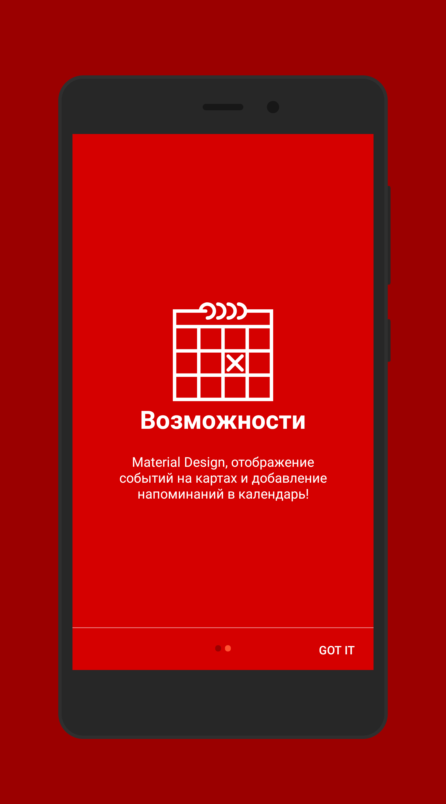
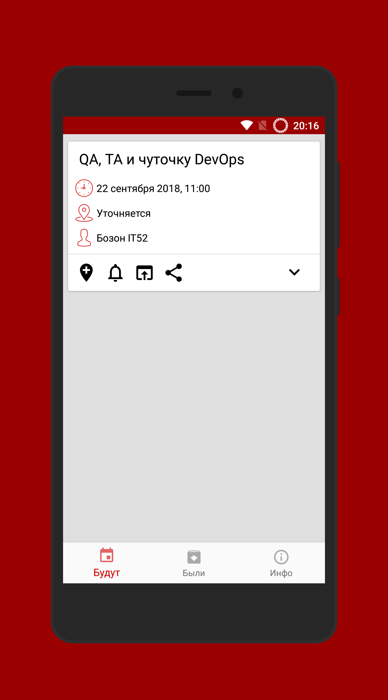
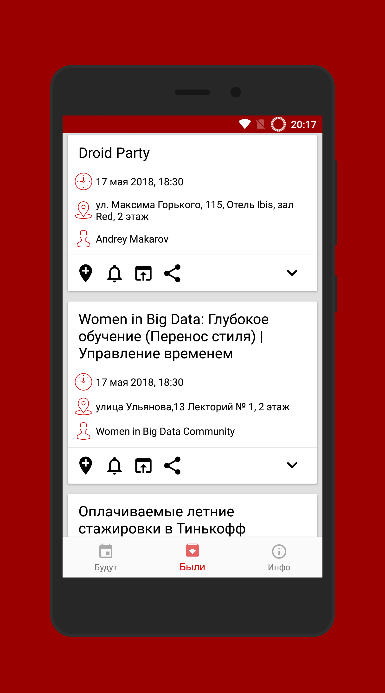
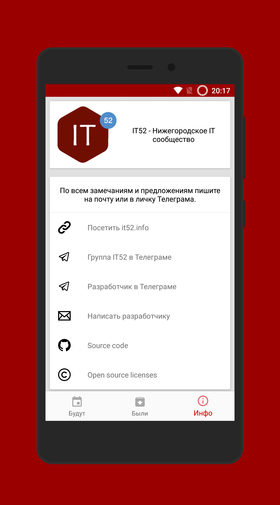

# IT52
Android application showing IT52 community events 

## Screenshots
<a href="./screenshots/screener_1530453997698.png"></a>
<a href="./screenshots/screener_1530454017344.png"></a>
<a href="./screenshots/screener_1530465542146.png"></a>
<a href="./screenshots/screener_1530465555795.png"></a>
<a href="./screenshots/screener_1530465677778.png"></a>

## License
```
 Copyright 2018 Defolter

  Licensed under the Apache License, Version 2.0 (the "License");
  you may not use this file except in compliance with the License.
  You may obtain a copy of the License at

      http://www.apache.org/licenses/LICENSE-2.0

  Unless required by applicable law or agreed to in writing, software
  distributed under the License is distributed on an "AS IS" BASIS,
  WITHOUT WARRANTIES OR CONDITIONS OF ANY KIND, either express or implied.
  See the License for the specific language governing permissions and
  limitations under the License.
```
